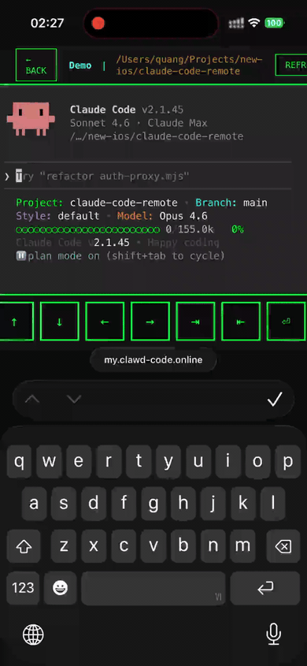

# claude-code-remote

[](https://opensource.org/licenses/MIT)
[](https://github.com/trmquang93/claude-code-remote)
[](https://nodejs.org)
[](https://github.com/trmquang93/claude-code-remote/stargazers)

Access [Claude Code CLI](https://docs.anthropic.com/en/docs/claude-code) from any browser on any device via HTTPS — phone, tablet, or any machine that can open a web page.

## Features

- **Multi-session dashboard** — create and manage multiple concurrent Claude Code sessions, each in a different project folder
- **Session persistence** — dtach keeps Claude running through browser disconnects; reconnecting reattaches to the same session
- **Secure by default** — scrypt-hashed passwords, HttpOnly session cookies, localhost-only service binding, HTTPS via Cloudflare Tunnel
- **Mobile-friendly** — works in iOS Safari, Android Chrome, and any modern browser; terminal auto-resizes

## Demo

<!-- Add a screenshot or GIF here showing the dashboard and terminal in action -->
<!-- Example:  -->

> Open your HTTPS URL on any device — log in, create a session pointing at a project folder, and get a full Claude Code terminal in the browser.

## Architecture

```
[Browser] --HTTPS--> [Cloudflare Tunnel] --localhost--> [auth-proxy:7681]
                                                              |
                                        +---------------------+---------------------+
                                        |                     |                     |
                                   GET /              GET /api/*            /terminal/*
                                   Dashboard       Session APIs          Proxy to ttyd:7682
                                                                                    |
                                                                    claude-ttyd-session <name> <folder>
                                                                                    |
                                                                    dtach -A <socket> claude
```

Three services:

| Service | Role |
|---------|------|
| **Cloudflare Tunnel** (`cloudflared`) | Provides HTTPS from the internet to localhost; no open inbound ports needed |
| **auth-proxy** (`auth-proxy.mjs`) | Node.js server — login page, multi-session dashboard, session APIs, WebSocket proxy to ttyd |
| **ttyd** | Turns a PTY into a WebSocket terminal; spawns `claude-ttyd-session` per connection |

## Prerequisites

- **macOS** (Linux/systemd support is a [welcome contribution](CONTRIBUTING.md))
- **Homebrew** — [brew.sh](https://brew.sh)
- **Node.js 18+**
- **Claude Code CLI** — `npm install -g @anthropic-ai/claude-code`
- **Claude authentication** — run `claude login` or set `ANTHROPIC_API_KEY` in your shell profile (`~/.zshrc` or `~/.bash_profile`) before setup. The session script sources your profile automatically, so any auth method that works in your terminal will work here.
- **A domain managed by Cloudflare** — a cheap domain ($1–12/year) on the free Cloudflare plan is sufficient

## Quick Start

```bash
git clone https://github.com/trmquang93/claude-code-remote.git
cd claude-code-remote
./setup.sh
```

The setup script will:

1. Prompt for your domain and subdomain
2. Prompt for a login username (default: `claude`)
3. Generate a secure random password
4. Install missing dependencies via Homebrew
5. Authenticate with Cloudflare and create a tunnel
6. Configure DNS in Cloudflare
7. Generate LaunchAgent plists and start all services
8. Display your access URL and credentials

After setup, open `https://yoursubdomain.yourdomain.com` in any browser.

## Configuration

Port and session expiry can be overridden with environment variables:

| Variable | Default | Description |
|----------|---------|-------------|
| `LISTEN_PORT` | `7681` | Port auth-proxy listens on |
| `TTYD_PORT` | `7682` | Port ttyd listens on |
| `SESSION_EXPIRY` | `86400000` | Auth cookie lifetime in milliseconds (24 h) |

Copy `.env.example` to `.env` and edit as needed, then restart the auth-proxy service.

## Usage

### Start / stop services

```bash
./start.sh
./stop.sh
```

### Check status

```bash
launchctl list | grep -E 'ttyd|authproxy|cloudflared'
lsof -i :7681   # auth-proxy
lsof -i :7682   # ttyd
```

### View logs

```bash
tail -f ~/Library/Logs/auth-proxy.log
tail -f ~/Library/Logs/ttyd-claude.log
tail -f ~/Library/Logs/cloudflared.log
```

### Change password

```bash
node hash-password.mjs <username> <new-password>
# Restarts auth-proxy automatically to pick up the new hash
```

### Session dashboard

Navigate to your HTTPS URL after login. From the dashboard you can:

- **Create a session** — enter a name and project folder path; autocomplete helps find directories
- **Open a session** — click "Open" to launch the terminal in a new browser tab
- **Delete a session** — kills the dtach process and removes the session entry

## Security

1. HTTPS encryption via Cloudflare edge
2. scrypt-hashed passwords (salt stored separately in `~/.config/claude-web/auth.json`)
3. HttpOnly, Secure, SameSite=Strict session cookies with configurable expiry
4. Localhost-only service binding (only `cloudflared` can reach auth-proxy; only auth-proxy can reach ttyd)
5. All routes except `/login` require an authenticated session cookie

## File Locations

| Path | Description |
|------|-------------|
| `auth-proxy.mjs` | Authentication proxy server |
| `claude-ttyd-session` | dtach wrapper script |
| `hash-password.mjs` | Password hashing utility |
| `setup.sh` / `start.sh` / `stop.sh` | Service management scripts |
| `~/.config/claude-web/auth.json` | Hashed credentials |
| `~/.config/claude-web/sessions.json` | Session metadata |
| `~/.config/claude-web/sockets/` | dtach socket files |
| `~/Library/LaunchAgents/com.authproxy.claude.plist` | auth-proxy service |
| `~/Library/LaunchAgents/com.ttyd.claude.plist` | ttyd service |
| `~/Library/LaunchAgents/com.cloudflared.tunnel.plist` | Cloudflare tunnel service |

## Troubleshooting

**Login page not showing** — check `lsof -i :7681` and `tail -f ~/Library/Logs/auth-proxy.error.log`

**Terminal not loading** — check `lsof -i :7682` and `tail -f ~/Library/Logs/ttyd-claude.error.log`; verify `which claude` returns a path

**Tunnel unreachable** — check `cloudflared tunnel info <tunnel-name>` and `~/Library/Logs/cloudflared.error.log`

**Session opens but shows wrong directory** — verify the folder still exists; the script falls back to `$HOME` if the path is missing

See [INSTALL.md](INSTALL.md) for the full installation guide and [CONTRIBUTING.md](CONTRIBUTING.md) for development setup.

## Cost

- **Cloudflare**: free (tunnels are included in the free plan)
- **Domain**: $1–12/year depending on TLD
- **Hosting**: free (runs on your own machine)
- **Claude API**: pay-per-use

## Contributing

Contributions are welcome — see [CONTRIBUTING.md](CONTRIBUTING.md). Linux/systemd support is a particularly useful area where help is needed.

## License

MIT — see [LICENSE](LICENSE).
